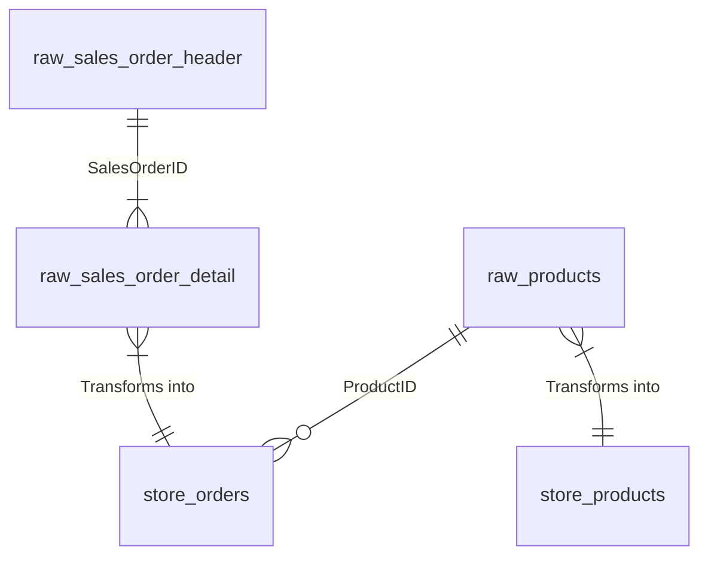

# Spark ETL Project with Docker

This project sets up a Spark standalone cluster using Docker and performs ETL operations on CSV files. The solution includes data transformations and analytical queries using PySpark for distributed processing.jobs.

## Project Structure

### Data Pipeline Architecture
```mermaid
graph TD
    A[CSV Source Files] --> B[Extract]
    B --> C[Transform]
    C --> D[Load to Delta]
    D --> E[Analytical Queries]

- `app/` - Contains all the Python scripts:
  - `main.py` - Orchestrates the execution of the pipeline.
  - `extract.py` - Handles data extraction from CSV files.
  - `transform.py` - Handles data transformations.
  - `load.py` - Loads the transformed data into local/Delta Lake (MinIO).
  - `analyse.py` - Contains the queries to answer the analysis questions.
  - `utils.py` - Contains utility libraries
  
- `Dockerfile` - Sets up the Spark container.
- `docker-compose.yml` - Orchestrates the services (Spark, SparkUI, MinIO).
- `.gitignore` - Git ignore file to avoid committing unnecessary files.
```
## Data Model Structure

### Tables and Keys

#### 1. Product Master (`raw_products`)
- **Primary Key**: `ProductID` (Integer)
- **Foreign Keys**: None
- **Fields**:
  - `ProductDesc` (String)
  - `Color` (String)
  - `ProductSubCategoryName` (String)
  - `ProductCategoryName` (String)

#### 2. Sales Order Header (`raw_sales_order_header`)
- **Primary Key**: `SalesOrderID` (Integer)  
- **Foreign Keys**: None
- **Fields**:
  - `OrderDate` (Date)
  - `ShipDate` (Date)
  - `Freight` (Double)

#### 3. Sales Order Detail (`raw_sales_order_detail`)
- **Composite Primary Key**: 
  - `SalesOrderID` (Integer)
  - `SalesOrderDetailID` (Integer)
- **Foreign Keys**:
  - `SalesOrderID` → `raw_sales_order_header.SalesOrderID`
  - `ProductID` → `raw_products.ProductID`
- **Fields**:
  - `OrderQty` (Integer)
  - `UnitPrice` (Double)
  - `UnitPriceDiscount` (Double)

### Transformed Tables

#### 1. `store_products` (Enhanced Product Data)
- Inherits same keys as `raw_products`
- Added business logic for `ProductCategoryName`

#### 2. `store_orders` (Joined Order Data)
- **Primary Key**: Composite from detail table
  - `SalesOrderID` (Integer)
  - `SalesOrderDetailID` (Integer)
- **Foreign Keys**:
  - `ProductID` → `store_products.ProductID`
- **Calculated Fields**:
  - `LeadTimeInBusinessDays` (Integer)
  - `TotalLineExtendedPrice` (Double)
  - `TotalOrderFreight` (Double)

### Key Relationships Diagram


## Prerequisites

Make sure you have the following tools installed on your machine:
- **Docker** - For containerization.
- **Docker Compose** - To manage multi-container Docker applications.
- **Resource in local machine** - To running containers

## Setup

1. Clone this repository:
    ```bash
    git clone https://github.com/HenriqueeqViana/spark-case.git
    cd docker
    ```

2. Build and start the Docker containers using Docker Compose:
    ```bash
    docker-compose up --build
    ```

3. The following services will be started:
    - **Spark Master** and **Spark Worker** (for Spark jobs).
    - **Spark UI** (for monitoring the Spark jobs' performance).
    - **MinIO** (for object storage, similar to AWS S3)(on going)

4. Once the services are up, you can start the ETL process by executing the `main.py` file. Open a new terminal and run:
    ```bash
    docker exec -it docker-spark-1 spark-submit   --packages io.delta:delta-core_2.12:2.1.0   --conf spark.sql.extensions=io.delta.sql.DeltaSparkSessionExtension   --conf spark.sql.catalog.spark_catalog=org.apache.spark.sql.delta.catalog.DeltaCatalog   /opt/spark-apps/app/main.py
    ```

5. After running the ETL pipeline, you can access the **Spark UI** by navigating to `http://localhost:8080` 

## Configuration

- **MinIO**:
  - Endpoint: `http://localhost:9000`
  - Access Key: `minio_access_key`
  - Secret Key: `minio_secret_key`

- **Spark UI**:
  - Access the Spark UI at `http://localhost:8080`.


## Data Quality Monitoring(on going)

Dataflint is integrated into the Spark job. It will monitor the quality of the data processed through the pipeline. You can access the **Dataflint UI** at `http://localhost:8888` to see the data quality status and configure alerts.

## Running Queries

Once the ETL process is completed, you can view the results directly in Spark. For example, to get the highest revenue by color for each year or the average lead time by product category, simply check the logs of the `main.py` run or access Spark’s **SQL** interface.

## Clean up

To stop the services, run:
```bash
docker-compose down
```

## Analytical Insights

### Revenue Performance

| Year | Top Performing Color | Revenue (USD) |
|------|----------------------|---------------|
| 2021 | Red                  | 66.9M         |
| 2022 | Black                | 381.8M        |
| 2023 | Black                | 402.3M        |
| 2024 | Yellow               | 118.4M        |

### Operational Efficiency

| Product Category | Avg Lead Time (Days) |
|------------------|----------------------|
| Bikes            | 5.67                 |
| Clothing         | 5.71                 |
| Accessories      | 5.70                 |
| Components       | 5.67                 |

## Reference 
[Spark Documentation](https://spark.apache.org/docs/3.5.3/index.html)
[Setting up a Spark Standalone Cluster on Docker](https://medium.com/@MarinAgli1/setting-up-a-spark-standalone-cluster-on-docker-in-layman-terms-8cbdc9fdd14b)